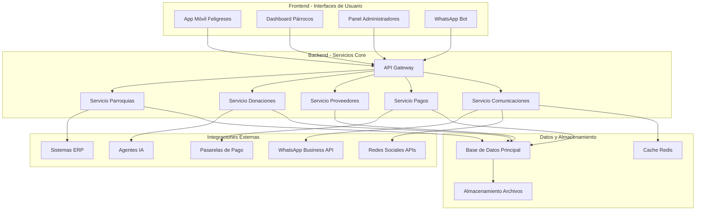
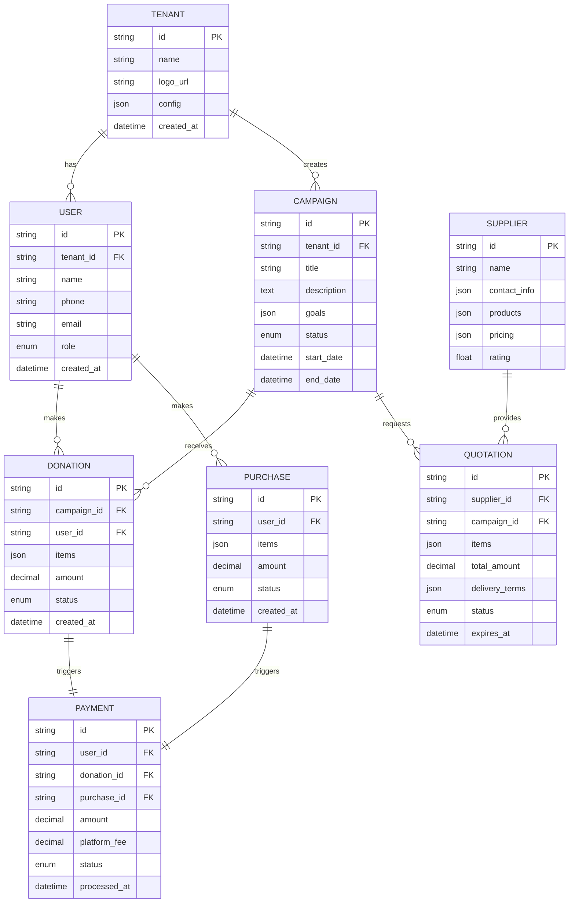
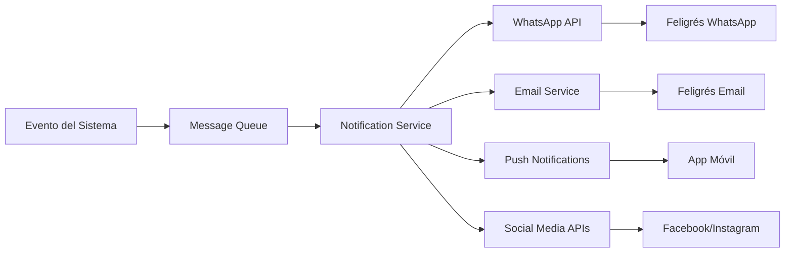
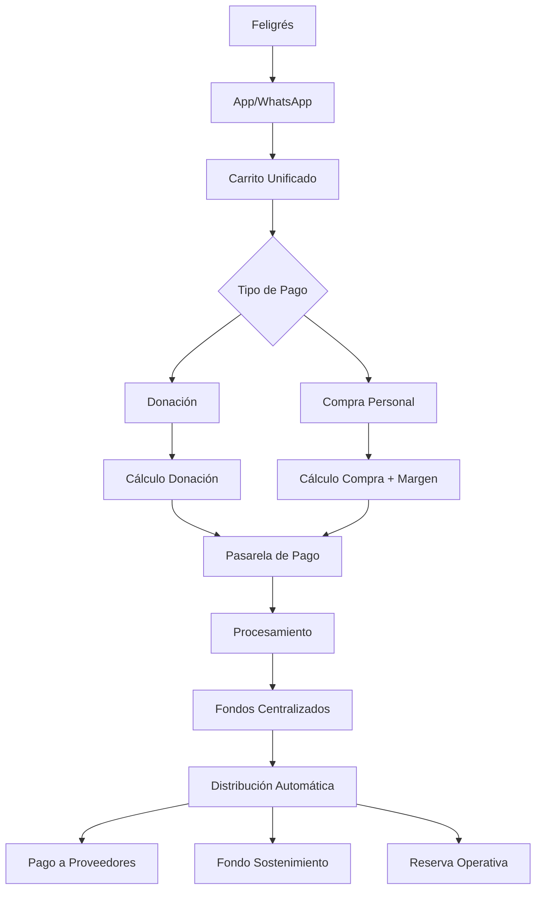

# Documento de Diseño - Red Pan Compartido

## Visión General

La Red Pan Compartido es una plataforma multi-parroquial que conecta donantes, consumidores y proveedores para facilitar la distribución de mercados alimenticios. El diseño prioriza la simplicidad, facilidad de uso y accesibilidad para usuarios de todos los niveles técnicos.

### Principios de Diseño UX/UI

1. **Simplicidad Extrema**: Interfaces minimalistas con máximo 3 acciones por pantalla
2. **Lenguaje Natural**: Textos en español coloquial, evitando tecnicismos
3. **Navegación Intuitiva**: Flujos lineales sin ramificaciones complejas
4. **Accesibilidad Universal**: Diseño responsive para móviles y escritorio
5. **Retroalimentación Inmediata**: Confirmaciones visuales claras en cada acción

## Arquitectura del Sistema

### Arquitectura de Alto Nivel



### Arquitectura Multi-Tenant

La plataforma utiliza un modelo de multi-tenancy a nivel de aplicación:

- **Tenant ID**: Cada parroquia tiene un identificador único
- **Datos Aislados**: Separación lógica por tenant en todas las tablas
- **Configuración Personalizada**: Cada parroquia puede personalizar colores, logos y mensajes
- **Escalabilidad**: Arquitectura preparada para miles de parroquias

## Componentes y Interfaces

### 1. Interfaz para Feligreses (App Móvil)

#### Pantalla Principal - "Mi Parroquia"
```
┌─────────────────────────────────┐
│ 🏛️ Parroquia San José           │
│                                 │
│ 📦 Necesidades Esta Semana      │
│ ┌─────────────────────────────┐ │
│ │ 🍚 Arroz: 25kg              │ │
│ │ 🥤 Aceite: 15 litros        │ │
│ │ 🐟 Atún: 50 latas           │ │
│ └─────────────────────────────┘ │
│                                 │
│ [💝 Quiero Donar]              │
│ [🛒 Comprar para Mi Familia]   │
│                                 │
│ 📊 Esta semana ayudamos a       │
│     45 familias                 │
└─────────────────────────────────┘
```

#### Flujo de Donación Simplificado
1. **Selección**: Lista visual de productos necesarios
2. **Cantidad**: Slider simple para elegir cantidad
3. **Confirmación**: Resumen claro con botón grande "Confirmar Donación"
4. **Pago**: Integración directa con pasarela (un solo clic)
5. **Agradecimiento**: Pantalla de confirmación con impacto generado

### 2. Dashboard para Párrocos

#### Vista Principal - "Estado de Mi Parroquia"
```
┌─────────────────────────────────────────────────────────┐
│ 📊 Dashboard - Parroquia San José                       │
│                                                         │
│ Esta Semana:                                           │
│ ┌─────────┐ ┌─────────┐ ┌─────────┐ ┌─────────┐       │
│ │   45    │ │   78    │ │  $2.5M  │ │   92%   │       │
│ │Familias │ │Donantes │ │Recaudado│ │ Meta    │       │
│ └─────────┘ └─────────┘ └─────────┘ └─────────┘       │
│                                                         │
│ 🚨 Necesidades Urgentes:                               │
│ • Aceite: Solo 40% de la meta                         │
│ • Azúcar: Solo 25% de la meta                         │
│                                                         │
│ [📢 Publicar Necesidad] [📱 Enviar WhatsApp]          │
└─────────────────────────────────────────────────────────┘
```

### 3. Panel de Administradores

#### Vista de Red Completa
- **Mapa Interactivo**: Visualización geográfica de parroquias
- **Métricas Consolidadas**: KPIs de toda la red
- **Gestión de Proveedores**: Panel de subastas y cotizaciones
- **Configuración Multi-Tenant**: Herramientas de personalización

### 4. WhatsApp Bot

#### Flujo de Conversación
```
Bot: ¡Hola! 👋 Soy el asistente de Pan Compartido
     ¿En qué puedo ayudarte?

Usuario: Quiero donar

Bot: ¡Excelente! 🙏 Esta semana necesitamos:
     1️⃣ Arroz (25kg pendientes)
     2️⃣ Aceite (15L pendientes)
     3️⃣ Atún (50 latas pendientes)
     
     Responde con el número de lo que quieres donar

Usuario: 1

Bot: ¿Cuántos kilos de arroz puedes donar?
     Escribe solo el número (ej: 5)

Usuario: 10

Bot: ¡Perfecto! 10kg de arroz = $45.000
     ¿También quieres comprar para tu familia?
     
     [Sí, agregar compra] [No, solo donar]
```

## Modelos de Datos

### Modelo de Datos Principal



### Estructura de Datos para Productos

```json
{
  "product": {
    "id": "arroz-blanco-25kg",
    "name": "Arroz Blanco",
    "category": "granos",
    "unit": "kg",
    "standard_package": 25,
    "image_url": "/images/arroz.jpg",
    "description": "Arroz blanco de primera calidad"
  }
}
```

### Estructura de Configuración Multi-Tenant

```json
{
  "tenant_config": {
    "branding": {
      "name": "Parroquia San José",
      "logo": "/logos/san-jose.png",
      "colors": {
        "primary": "#2563eb",
        "secondary": "#10b981"
      }
    },
    "contact": {
      "phone": "300-123-4567",
      "email": "contacto@parroquiasanjose.org",
      "address": "Calle 123 #45-67, Bogotá"
    },
    "settings": {
      "campaign_frequency": "weekly",
      "min_order_amount": 50000,
      "platform_fee_percentage": 5
    }
  }
}
```

## Gestión de Errores

### Estrategia de Manejo de Errores

1. **Errores de Usuario**: Mensajes amigables en español coloquial
2. **Errores de Sistema**: Logging detallado + mensaje genérico al usuario
3. **Errores de Integración**: Reintentos automáticos + notificación a administradores
4. **Errores de Pago**: Rollback automático + notificación inmediata

### Ejemplos de Mensajes de Error

```javascript
const errorMessages = {
  payment_failed: "No pudimos procesar tu pago. Por favor verifica tu tarjeta e intenta de nuevo.",
  network_error: "Parece que hay problemas de conexión. Intenta de nuevo en un momento.",
  invalid_phone: "El número de teléfono no es válido. Debe tener 10 dígitos.",
  campaign_ended: "Esta campaña ya terminó, pero puedes ver las necesidades actuales en el inicio."
};
```

## Estrategia de Testing

### Testing de Usabilidad

1. **Pruebas con Usuarios Reales**: Párrocos y feligreses de diferentes edades
2. **Testing de Accesibilidad**: Verificación con lectores de pantalla
3. **Testing Multi-dispositivo**: Pruebas en diferentes tamaños de pantalla
4. **Testing de Conectividad**: Funcionamiento con conexiones lentas

### Testing Técnico

1. **Unit Tests**: Cobertura mínima del 80% en lógica de negocio
2. **Integration Tests**: Pruebas de APIs y integraciones externas
3. **Load Testing**: Simulación de miles de usuarios concurrentes
4. **Security Testing**: Auditorías de seguridad regulares

### Métricas de Calidad UX

```javascript
const uxMetrics = {
  task_completion_rate: "> 95%",
  average_task_time: "< 2 minutos",
  user_error_rate: "< 5%",
  user_satisfaction_score: "> 4.5/5",
  mobile_usability_score: "> 90%"
};
```

## Arquitectura de Comunicaciones

### Sistema de Notificaciones



### Templates de Mensajes

```javascript
const messageTemplates = {
  new_campaign: {
    whatsapp: "🙏 ¡Hola {name}! Tu parroquia necesita tu ayuda esta semana:\n{needs}\n¿Puedes colaborar? Responde SÍ para donar.",
    social: "🏛️ {parish_name} necesita tu ayuda:\n{needs}\n¡Únete a nuestra misión! 💝 #PanCompartido"
  },
  donation_confirmed: {
    whatsapp: "¡Gracias {name}! 🙏 Tu donación de {items} está confirmada. Con tu ayuda alimentaremos a {families} familias.",
    email: "Confirmación de donación - Pan Compartido"
  }
};
```

## Sistema de Pagos Centralizado

### Arquitectura de Pagos



### Flujo de Pago Unificado

#### 1. Carrito Unificado
```javascript
const unifiedCart = {
  user_id: "user-123",
  tenant_id: "parroquia-san-jose",
  items: [
    {
      type: "donation",
      product: "arroz",
      quantity: 10,
      unit: "kg",
      unit_price: 4500,
      total: 45000,
      beneficiary: "campaign-456"
    },
    {
      type: "personal_purchase",
      product: "arroz",
      quantity: 5,
      unit: "kg",
      unit_price: 4500,
      margin: 500, // Margen para sostenimiento
      total: 25000
    }
  ],
  subtotal_donation: 45000,
  subtotal_purchase: 22500,
  platform_fee: 2500, // 5% del total
  total_amount: 70000
};
```

#### 2. Procesamiento de Pago
```javascript
const paymentFlow = {
  step1: "Validación de carrito y disponibilidad",
  step2: "Cálculo de totales y fees",
  step3: "Tokenización de tarjeta (PCI compliance)",
  step4: "Procesamiento con pasarela",
  step5: "Confirmación y distribución de fondos",
  step6: "Notificaciones y confirmaciones"
};
```

### Pasarelas de Pago Integradas

#### Configuración Multi-Pasarela
```javascript
const paymentGateways = {
  colombia: {
    primary: "wompi",
    secondary: "payu",
    methods: ["credit_card", "debit_card", "pse", "nequi", "daviplata"]
  },
  mexico: {
    primary: "stripe",
    secondary: "conekta",
    methods: ["credit_card", "oxxo", "spei"]
  },
  default: {
    primary: "stripe",
    methods: ["credit_card", "paypal"]
  }
};
```

#### Interfaz de Pago Simplificada
```
┌─────────────────────────────────┐
│ 💳 Confirmar Pago               │
│                                 │
│ 💝 Donación:        $45.000     │
│ 🛒 Mi compra:       $22.500     │
│ 🏗️ Sostenimiento:    $2.500     │
│ ─────────────────────────────── │
│ 💰 Total:           $70.000     │
│                                 │
│ 💳 [Tarjeta terminada en 1234] │
│                                 │
│ [🔒 Pagar Ahora]               │
│                                 │
│ 🔐 Pago 100% seguro             │
└─────────────────────────────────┘
```

### Distribución Automática de Fondos

#### Lógica de Distribución
```javascript
const fundDistribution = {
  calculateDistribution: (payment) => {
    const distribution = {
      supplier_payment: 0,
      platform_fee: 0,
      operational_reserve: 0
    };
    
    // Para donaciones: 95% a proveedores, 5% sostenimiento
    const donationAmount = payment.donation_total;
    distribution.supplier_payment += donationAmount * 0.95;
    distribution.platform_fee += donationAmount * 0.05;
    
    // Para compras personales: costo + margen
    const purchaseAmount = payment.purchase_total;
    const costPrice = purchaseAmount * 0.85; // 85% costo real
    const margin = purchaseAmount * 0.15; // 15% margen
    
    distribution.supplier_payment += costPrice;
    distribution.platform_fee += margin * 0.6; // 60% del margen
    distribution.operational_reserve += margin * 0.4; // 40% reserva
    
    return distribution;
  }
};
```

### Gestión de Proveedores y Pagos

#### Automatización de Pagos a Proveedores
```javascript
const supplierPayments = {
  processAutomaticPayments: async (campaignId) => {
    // 1. Consolidar pedidos por proveedor
    const ordersBySupplier = await consolidateOrders(campaignId);
    
    // 2. Generar órdenes de compra
    for (const supplier of ordersBySupplier) {
      const purchaseOrder = {
        supplier_id: supplier.id,
        items: supplier.items,
        total_amount: supplier.total,
        delivery_date: supplier.delivery_date,
        payment_terms: "immediate" // Pago inmediato
      };
      
      // 3. Procesar pago automático
      await processSupplierPayment(purchaseOrder);
      
      // 4. Enviar orden al proveedor
      await sendPurchaseOrder(supplier.contact, purchaseOrder);
    }
  }
};
```

#### Panel de Control Financiero
```
┌─────────────────────────────────────────────────────────┐
│ 💰 Control Financiero - Esta Semana                     │
│                                                         │
│ 📊 Ingresos:                                           │
│ • Donaciones:           $2.850.000                     │
│ • Compras personales:   $1.200.000                     │
│ • Total recaudado:      $4.050.000                     │
│                                                         │
│ 💸 Egresos:                                            │
│ • Pagos a proveedores:  $3.400.000                     │
│ • Sostenimiento:          $405.000                     │
│ • Reserva operativa:      $245.000                     │
│                                                         │
│ 🏦 Estado de Pagos:                                    │
│ • Banco de Alimentos:   ✅ Pagado                      │
│ • Camilo (Frutas):      ⏳ Pendiente                   │
│ • Alimentos Biff:       ✅ Pagado                      │
│                                                         │
│ [📄 Ver Detalles] [💳 Procesar Pagos Pendientes]      │
└─────────────────────────────────────────────────────────┘
```

### Seguridad en Pagos

#### Medidas de Seguridad PCI DSS
```javascript
const paymentSecurity = {
  tokenization: "Tarjetas tokenizadas, nunca almacenamos números reales",
  encryption: "AES-256 para datos sensibles",
  pci_compliance: "Certificación PCI DSS Level 1",
  fraud_detection: "ML para detección de transacciones sospechosas",
  secure_transmission: "TLS 1.3 para todas las comunicaciones",
  audit_trail: "Log completo de todas las transacciones"
};
```

#### Manejo de Errores de Pago
```javascript
const paymentErrorHandling = {
  insufficient_funds: {
    message: "Tu tarjeta no tiene fondos suficientes. Intenta con otra tarjeta.",
    action: "retry_with_different_card"
  },
  card_declined: {
    message: "Tu banco rechazó la transacción. Contacta a tu banco o intenta con otra tarjeta.",
    action: "contact_bank_or_retry"
  },
  network_error: {
    message: "Hubo un problema de conexión. Tu dinero está seguro, intenta de nuevo.",
    action: "retry_automatically"
  },
  system_error: {
    message: "Algo salió mal de nuestro lado. Tu dinero no fue cobrado, intenta de nuevo.",
    action: "retry_with_support"
  }
};
```

### Reportes Financieros

#### Dashboard Financiero para Administradores
```javascript
const financialReports = {
  daily: {
    total_processed: "$450.000",
    donations: "$300.000",
    purchases: "$150.000",
    platform_fees: "$22.500",
    supplier_payments: "$380.000"
  },
  weekly: {
    growth_rate: "+15%",
    top_parishes: ["San José", "Santa María", "San Pedro"],
    payment_methods: {
      credit_card: "60%",
      debit_card: "25%",
      pse: "10%",
      digital_wallets: "5%"
    }
  },
  monthly: {
    total_volume: "$18.500.000",
    active_parishes: 45,
    average_donation: "$35.000",
    platform_sustainability: "105% of target"
  }
};
```

## Integración con Sistemas Externos

### APIs Expuestas

```yaml
# API Documentation (OpenAPI 3.0)
paths:
  /api/v1/tenants/{tenant_id}/campaigns:
    get:
      summary: Obtener campañas activas
      parameters:
        - name: tenant_id
          in: path
          required: true
          schema:
            type: string
      responses:
        200:
          description: Lista de campañas
          content:
            application/json:
              schema:
                type: array
                items:
                  $ref: '#/components/schemas/Campaign'
  
  /api/v1/donations:
    post:
      summary: Crear nueva donación
      requestBody:
        required: true
        content:
          application/json:
            schema:
              $ref: '#/components/schemas/DonationRequest'
      responses:
        201:
          description: Donación creada exitosamente
```

### Webhooks para Integraciones

```javascript
const webhookEvents = {
  'donation.created': {
    url: 'https://erp-system.com/webhooks/donation',
    payload: {
      event: 'donation.created',
      tenant_id: 'parroquia-san-jose',
      donation: { /* datos de la donación */ }
    }
  },
  'campaign.completed': {
    url: 'https://accounting-system.com/webhooks/campaign',
    payload: {
      event: 'campaign.completed',
      campaign_id: 'campaign-123',
      total_raised: 2500000
    }
  }
};
```

## Seguridad y Privacidad

### Medidas de Seguridad

1. **Autenticación**: OAuth 2.0 + JWT tokens
2. **Autorización**: RBAC (Role-Based Access Control)
3. **Encriptación**: TLS 1.3 para todas las comunicaciones
4. **Datos Sensibles**: Encriptación AES-256 en base de datos
5. **Auditoría**: Logs detallados de todas las transacciones

### Privacidad de Datos

1. **GDPR Compliance**: Derecho al olvido y portabilidad de datos
2. **Consentimiento**: Opt-in explícito para comunicaciones
3. **Anonimización**: Datos estadísticos sin información personal
4. **Retención**: Políticas claras de retención de datos

## Escalabilidad y Performance

### Estrategia de Escalabilidad

1. **Horizontal Scaling**: Microservicios independientes
2. **Database Sharding**: Particionamiento por tenant
3. **CDN**: Distribución global de contenido estático
4. **Caching**: Redis para datos frecuentemente accedidos
5. **Load Balancing**: Distribución inteligente de carga

### Métricas de Performance

```javascript
const performanceTargets = {
  api_response_time: "< 200ms (p95)",
  page_load_time: "< 2 segundos",
  database_query_time: "< 50ms (p95)",
  uptime: "> 99.9%",
  concurrent_users: "10,000+"
};
```

Este diseño prioriza la simplicidad y facilidad de uso mientras mantiene la robustez técnica necesaria para una plataforma escalable. La arquitectura modular permite implementación incremental y adaptación a las necesidades específicas de cada parroquia.